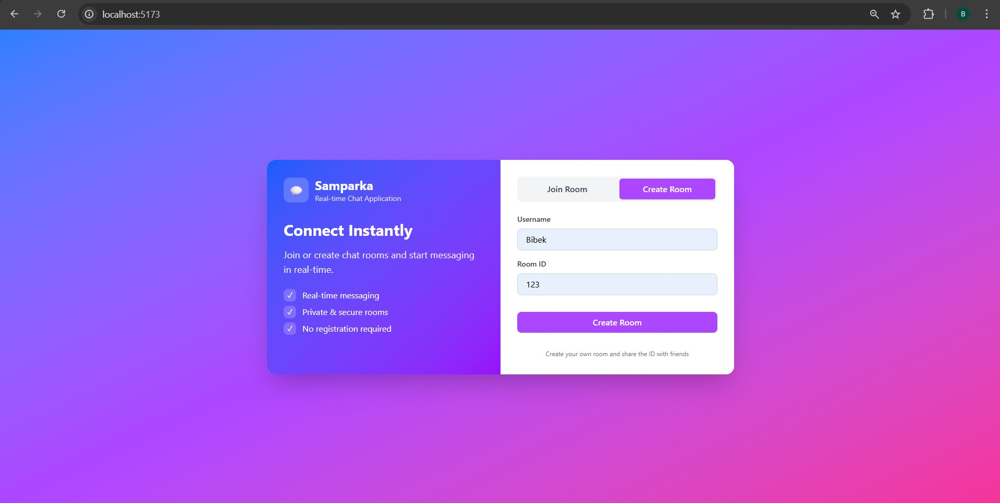
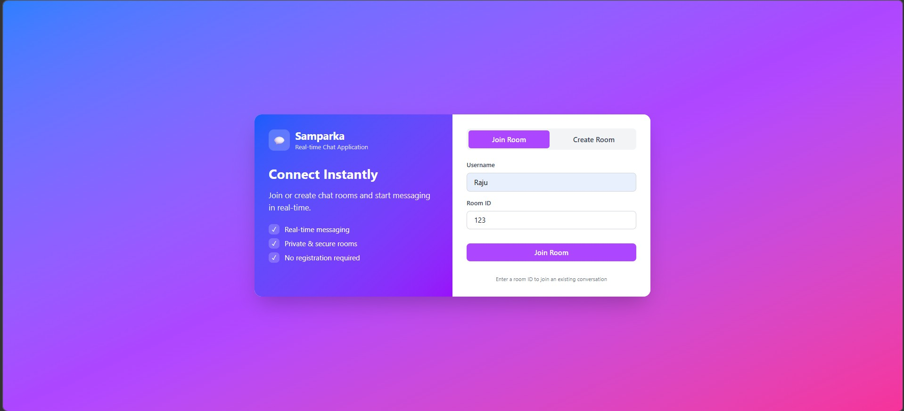
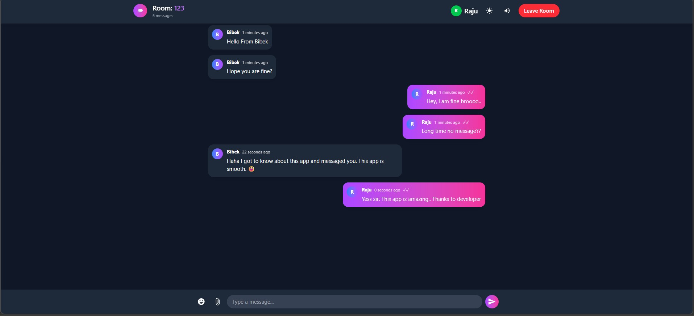
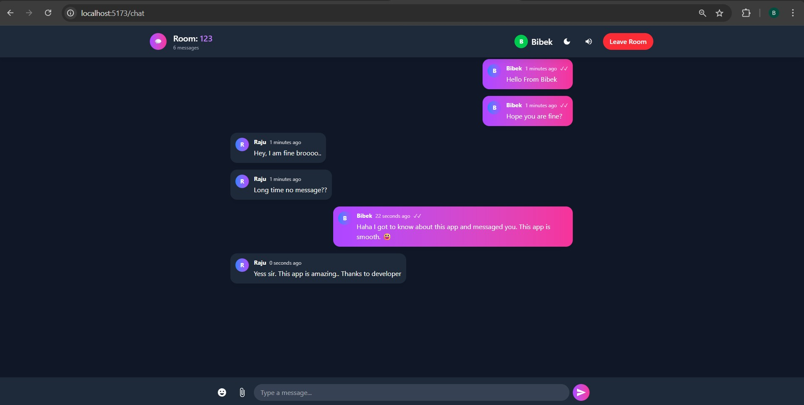

# 💬 Samparka - Real-Time Chat Application

<div align="center">
  
  [](https://reactjs.org/)
  [](https://spring.io/)
  [](https://developer.mozilla.org/en-US/docs/Web/API/WebSockets_API)
  [](https://www.mongodb.com/)
  [](LICENSE)
</div>

---

## 📖 About Samparka

**Samparka** (संपर्क - meaning "Connection" in Sanskrit) is a modern, real-time chat application that enables users to create and join chat rooms for seamless communication. Built with cutting-edge technologies, it provides a smooth, responsive, and feature-rich messaging experience.

## 📸 Screenshots

<div align="center">
  <table>
    <tr>
      <td align="center"><strong>Create Room</strong></td>
      <td align="center"><strong>Join Room</strong></td>
    </tr>
    <tr>
      <td align="center"></td>
      <td align="center"></td>
    </tr>
  </table>
</div>

<div align="center">
  <table>
    <tr>
      <td align="center"><strong>Chat Interface 1</strong></td>
      <td align="center"><strong>Chat Interface 2</strong></td>
    </tr>
    <tr>
      <td align="center"></td>
      <td align="center"></td>
    </tr>
  </table>
</div>

### ✨ Key Features

- 🚀 **Real-time Messaging** - Instant message delivery using WebSocket protocol
- 🏠 **Room-based Chat** - Create or join public/private chat rooms
- 👥 **Multi-user Support** - Multiple users can join the same room
- 💾 **Message Persistence** - All messages are stored in MongoDB
- 🎨 **Modern UI** - Beautiful, responsive design with dark/light mode
- 📎 **File Sharing** - Share images and documents
- 😊 **Emoji Support** - Rich emoji picker for expressive communication
- ✏️ **Message Actions** - Edit, delete, and reply to messages
- ⌨️ **Typing Indicators** - See when others are typing
- 🔔 **Notifications** - Sound alerts for new messages
- 🌓 **Dark/Light Mode** - Toggle between themes
- 📱 **Responsive Design** - Works perfectly on mobile, tablet, and desktop

-

---

## 🛠️ Technology Stack

### Frontend
- **React 18** - UI Library
- **Vite** - Build Tool
- **Tailwind CSS** - Styling
- **React Router DOM** - Navigation
- **STOMP.js & SockJS** - WebSocket Client
- **React Hot Toast** - Notifications
- **React Icons** - Icons
- **Emoji Picker React** - Emoji Support

### Backend
- **Spring Boot 3.0** - Backend Framework
- **Spring WebSocket** - WebSocket Support
- **Spring Data MongoDB** - Database Operations
- **MongoDB** - NoSQL Database
- **Maven** - Build Tool

---

## 📋 Prerequisites

Before running the application, make sure you have:

- **Node.js** (v18 or higher)
- **Java JDK** (v17 or higher)
- **Maven** (v3.6 or higher)
- **MongoDB** (v6.0 or higher)
- **Git** (for version control)

---

## 🚀 Installation & Setup

### 1. Clone the Repository
```bash
git clone https://github.com/yourusername/samparka-chat-app.git
cd samparka-chat-app
2. Backend Setup (Spring Boot)
bash
# Navigate to backend directory
cd realtime-chat-application-backend

# Configure MongoDB
# Update application.properties with your MongoDB connection string
# For local MongoDB: mongodb://localhost:27017/chatdb

# Build the application
mvn clean install

# Run the backend server
mvn spring-boot:run
The backend will start at http://localhost:8080

3. Frontend Setup (React)
bash
# Navigate to frontend directory
cd ../realtime-chat-application-frontend

# Install dependencies
npm install

# Create .env file
echo "VITE_API_URL=http://localhost:8080" > .env

# Run the development server
npm run dev
The frontend will start at http://localhost:5173


### How to Use Samparka
Creating a Room
Enter your Username

Enter a unique Room ID

Click "Create Room"

Share the Room ID with friends to join

Joining a Room
Enter your Username

Enter the Room ID shared with you

Click "Join Room"

Start chatting instantly!

Chat Features
Send Messages: Type and press Enter or click Send

Send Emojis: Click the emoji button to pick emojis

Share Files: Click the attachment button to upload files

Edit Message: Right-click your message → Edit

Delete Message: Right-click your message → Delete

Reply to Message: Right-click any message → Reply

Copy Message: Right-click message → Copy

Dark Mode: Click the moon/sun icon in header


🔌 API Endpoints
REST Endpoints
Method	Endpoint	Description
POST	/api/v1/rooms	Create a new room
GET	/api/v1/rooms/{roomId}	Get room details
GET	/api/v1/rooms/{roomId}/messages	Get room messages
POST	/api/v1/upload	Upload files
WebSocket Endpoints
Endpoint	Description
/chat	WebSocket connection endpoint
/app/sendMessage/{roomId}	Send message to room
/topic/room/{roomId}	Subscribe to room messages
/app/typing/{roomId}	Send typing indicator
🐳 Docker Deployment
Build and Run with Docker Compose
bash
# Create docker-compose.yml
docker-compose up --build
Docker Commands
bash
# Build backend image
docker build -t samparka-backend ./realtime-chat-application-backend

# Build frontend image
docker build -t samparka-frontend ./realtime-chat-application-frontend

# Run containers
docker run -p 8080:8080 samparka-backend
docker run -p 80:80 samparka-frontend
☁️ Deployment on Render
Backend Deployment
Push code to GitHub

Go to render.com

Click "New +" → "Web Service"

Connect repository

Configure:

Build Command: ./mvnw clean package -DskipTests

Start Command: java -jar target/*.jar

Environment Variables:

PORT=8080

MONGODB_URI=your_mongodb_uri

Frontend Deployment
Create new Web Service

Configure:

Build Command: npm install && npm run build

Publish Directory: dist

Environment Variables:

VITE_API_URL=https://your-backend-url.onrender.com


🤝 Contributing
Contributions are welcome! Here's how you can help:

Fork the repository

Create a feature branch (git checkout -b feature/AmazingFeature)

Commit changes (git commit -m 'Add AmazingFeature')

Push to branch (git push origin feature/AmazingFeature)

Open a Pull Request


✅ **Backend Development (Spring Boot)**
- Setting up Spring Boot project with WebSocket dependencies
- MongoDB configuration and entity design
- Creating REST APIs for room management
- Implementing WebSocket with STOMP protocol
- Message persistence and retrieval
- File upload handling

✅ **Frontend Development (React + Vite)**
- Building modern UI with Tailwind CSS
- State management with React Context API
- WebSocket integration using STOMP.js and SockJS
- Real-time message updates
- Dark/Light mode implementation
- Responsive design for all devices

✅ **Real-Time Features**
- Room-based chat system
- Typing indicators
- Message reactions
- File sharing
- Emoji picker
- Message editing/deletion
- Reply to messages


### 🔧 Technologies Used:

- **Frontend:** React 18, Vite, Tailwind CSS, STOMP.js, SockJS
- **Backend:** Spring Boot 3, Spring WebSocket, Spring Data MongoDB
- **Database:** MongoDB
- **Protocol:** WebSocket (STOMP)
- **Deployment:** Render, Docker


### 💻 Commands Used:

```bash
# Backend Setup
mvn spring-boot:run

# Frontend Setup
npm create vite@latest realtime-chat-application-frontend -- --template react
npm install react-router-dom react-hot-toast sockjs-client @stomp/stompjs
npm install -D tailwindcss postcss autoprefixer
npm run dev
🎓 Prerequisites:
Basic knowledge of Java and Spring Boot

Understanding of React basics

MongoDB installed locally or use MongoDB Atlas

🌟 Features Implemented:
✅ Real-time messaging

✅ Room creation/joining

✅ File sharing

✅ Emoji support

✅ Dark/Light theme

✅ Typing indicators

✅ Message persistence

✅ Responsive design

✅ And much more!


